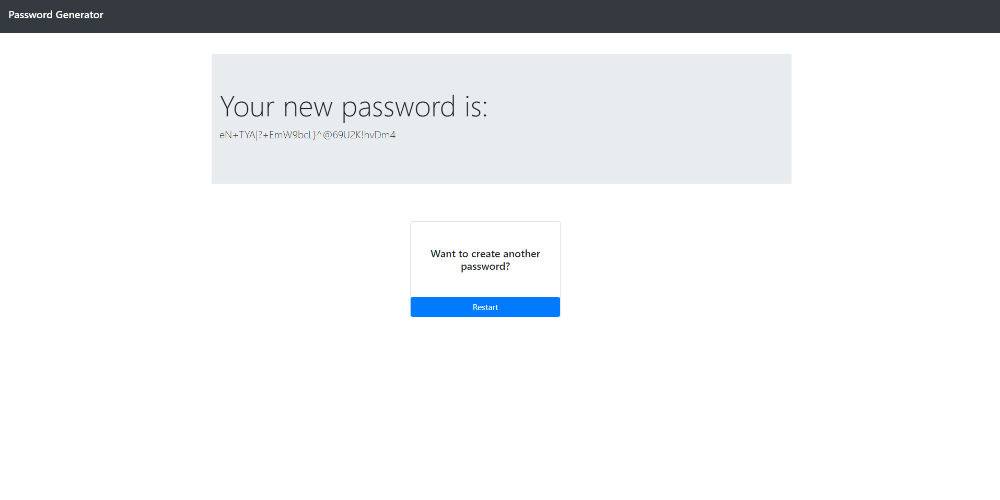

# Password-Generator

This application can generate a password from 8 to 128 charactrers consisting of any combination of the following, as selected by the user: - Upper Case Characters - Lower Case Characters - Numbers - Special Characters

This application utilizes bootstrap, jquery, and dom manipulation to create a flowing product.

